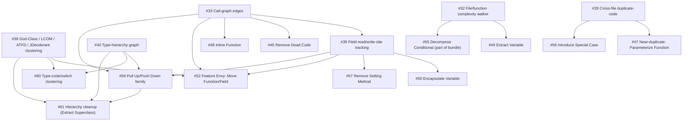

# Refactoring catalog analysis

Scores all 66 entries in Martin Fowler's refactoring catalog
([refactoring.com/catalog](https://refactoring.com/catalog/), *Refactoring*,
2nd ed.) against what kibitzer can structurally detect, with literature
backing for the ones worth building and a dependency graph for the new
issues it produced.

## How this differs from `check-ideas.md`

`docs/check-ideas.md` requires a confirmed transcript occurrence (2+
independent sightings of the same agent mistake) before a check idea earns
anything beyond the "untested ideas" bucket — that bar exists because kibitzer's
early checks were built on plausible-sounding ideas that never actually fired
on real code. This document uses a different, complementary justification:
a refactoring that's independently well-established in the software-engineering
literature and has a structural (not semantic) trigger condition. Neither bar
substitutes for the other — an item recommended here should still go through
`kibitzer check backtest` (`docs/backtesting.md`) against real repos before
shipping as more than advisory, the same as any other check.

## Scope and a caveat

The catalog's chapter groupings below are inferred from the book's known
structure. The live index page at refactoring.com is a JS-rendered SPA that
doesn't expose per-card chapter tags without fetching all 66 individual
pages, which this pass didn't do — the refactoring *names* and the full list
of 66 are directly verified against the rendered page; the chapter assignment
is high-confidence but not independently re-verified against each card.

## Literature and prior art

The single most load-bearing prior source is
[#38](https://github.com/tstapler/kibitzer/issues/38), kibitzer's own existing
research issue on deterministic architecture analysis — it already surveys
and cites most of the smell-detection literature relevant here (God-Class
metrics, JDeodorant's Extract-Class clustering, code-maat/CodeScene coupling,
EM-Assist's LLM-hallucination-filtering result). This document doesn't
re-derive that; it extends it to cover the refactorings #38 doesn't touch.

**The catalog itself**

- Fowler, M. with Beck, K., *Refactoring: Improving the Design of Existing
  Code*, 2nd ed., Addison-Wesley, 2018. The 66 entries analyzed here, plus
  the "Bad Smells in Code" chapter that motivates most of them.

**Code smell and clone detection, survey level**

- Fontana, F.A. et al., "Automatic detection of bad smells in code: An
  experimental assessment," Journal of Object Technology, 2012 — compares
  smell-detection tools (JDeodorant, PMD, etc.) and finds detection accuracy
  varies enormously by smell type; directly relevant to why this document
  treats some refactorings as high-confidence and others as "flag with wide
  error bars, advisory only."
- Sharma, T. & Spinellis, D., "A Survey on Software Smells," Journal of
  Systems and Software, 2018 (already cited in #38) — the broadest survey of
  what's detectable and how.
- Roy, C.K. & Cordy, J.R., "A Survey on Software Clone Detection Research,"
  Queen's University TR 2007-541 — the token/AST/PDG-based clone-detection
  technique families behind `duplicate-code` (#28) and the near-duplicate
  extension proposed in #47.

**Object-oriented metrics**

- Chidamber, S.R. & Kemerer, C.F., "A Metrics Suite for Object Oriented
  Design," IEEE TSE, 1994 — the CK metrics suite (WMC, DIT, NOC, CBO, RFC,
  LCOM). LCOM and WMC are the backbone of #38's God-Class work and this
  document's Extract Class / Inline Class verdicts.
- Lanza, M. & Marinescu, R., *Object-Oriented Metrics in Practice*,
  Springer, 2006, and Marinescu, R., "Detection strategies: Metrics-based
  rules for detecting design flaws," ICSM 2004 — the metrics-threshold
  methodology (combine 2-3 metrics with AND, not any single metric alone)
  #38 already adopts for its PMD-style/iPlasma-style God-Class thresholds.

**Specific refactoring-detection algorithms**

- Tsantalis, N. & Chatzigeorgiou, A., "Identification of Move Method
  Refactoring Opportunities," IEEE TSE, 2009 — the JDeodorant Move Method
  algorithm, a distance-based Feature Envy metric. Backs
  [#52](https://github.com/tstapler/kibitzer/issues/52).
- Fokaefs, M. et al., "Identification and application of Extract Class
  refactorings," Journal of Systems and Software, 2012 (already cited in
  #38) — the JDeodorant Extract Class algorithm (Jaccard-distance clustering
  over shared attribute access, ranked by the Entity Placement metric).
  Backs Extract Class/Inline Class (covered by #38 directly, no separate
  issue) and [#61](https://github.com/tstapler/kibitzer/issues/61) (Extract
  Superclass).
- Moha, N. et al., "DECOR: A Method for the Specification and Detection of
  Code and Design Smells," IEEE TSE, 2010 — a formal rule-card methodology
  for defining a smell as a composition of metric thresholds and structural
  properties; the template this document's per-item "Detection" sketches
  loosely follow.
- Lieberherr, K., Holland, I. & Riel, A., "Object-Oriented Programming: An
  Objective Sense of Style," OOPSLA 1988 — introduces the Law of Demeter,
  the principle behind [#44](https://github.com/tstapler/kibitzer/issues/44)
  (Hide Delegate).
- Meyer, B., *Object-Oriented Software Construction*, Prentice Hall,
  1988/1997 — Command-Query Separation, the principle Separate Query from
  Modifier is named for (see verdict below — not recommended for automated
  detection despite the well-established principle, because violating it is
  often intentional).
- McCabe, T.J., "A Complexity Measure," IEEE TSE, 1976 — cyclomatic
  complexity, the metric behind
  [#32](https://github.com/tstapler/kibitzer/issues/32) and the shared
  infrastructure several items below build on.

**Tools as existence proofs**

- [JDeodorant](https://github.com/tsantalis/JDeodorant) (Tsantalis et al.) —
  a real, shipped implementation of Extract Method, Move Method, Extract
  Class, and Type-Checking-to-State/Strategy detection. Its existence is
  itself evidence these are tractable, not just theoretically interesting.
- [RefactoringMiner](https://github.com/tsantalis/RefactoringMiner)
  (Tsantalis et al., ICSE 2018 and later) — detects refactorings already
  applied in commit history. Different problem (retrospective, not
  prospective) but same underlying pattern definitions; worth revisiting if
  kibitzer ever wants a "did this PR actually do the refactoring it claims"
  check.
- PMD, SonarQube, and ESLint rule catalogs — cited per-item below where a
  mature linter already ships an equivalent rule; used as evidence a check
  is mechanically tractable at industrial scale, not as a design to copy
  verbatim.
- EM-Assist, arXiv:2405.20551 (already cited in #38) — found up to 76% of
  raw LLM-suggested Extract Method refactorings were hallucinated before
  static-analysis filtering. The methodological takeaway adopted throughout
  this document and its issues: detection stays deterministic (AST/graph
  facts), and only naming/prose/tie-breaking is left to an LLM.

## Capability dependency graph

Two new foundational issues unblock most of the "new capability" items
below. Existing issues #33 (call-graph edges), #32 (complexity walker), #28
(cross-file duplicate detection), and #38 (God-Class/LCOM/ATFD/JDeodorant
clustering) already cover the rest of the prerequisite surface — see the
cross-reference comments added to each.

No-dependency issues (extend `rules.rs`/`ArchModel` directly, ship
independently): [#41](https://github.com/tstapler/kibitzer/issues/41)
(cite-by-name), [#42](https://github.com/tstapler/kibitzer/issues/42)
(Replace Magic Literal), [#43](https://github.com/tstapler/kibitzer/issues/43)
(Remove Flag Argument), [#44](https://github.com/tstapler/kibitzer/issues/44)
(Hide Delegate), [#46](https://github.com/tstapler/kibitzer/issues/46)
(Encapsulate Collection), [#51](https://github.com/tstapler/kibitzer/issues/51)
(Introduce Parameter Object), [#53](https://github.com/tstapler/kibitzer/issues/53)
(Remove Middle Man), [#54](https://github.com/tstapler/kibitzer/issues/54)
(Split Loop), part of [#55](https://github.com/tstapler/kibitzer/issues/55)
(Consolidate Conditional Expression, Remove Control Flag), and
[#58](https://github.com/tstapler/kibitzer/issues/58) (Replace Error Code
with Exception).

**Suggested build order**: #33 → #39 and #40 in parallel (both build on #33's
walk-and-resolve machinery, but #40's hard case — Go structural interface
satisfaction — is independent work) → the no-dependency batch can start
immediately, in parallel with all of the above.

## The full catalog

Legend: ✅ covered today · 🔧 issue filed, extends the existing engine ·
🧩 issue filed, needs a new capability · 🔗 already covered by an existing
issue, no new issue filed · ⛔ not recommended.

### Chapter 6 — A First Set of Refactorings

| Refactoring | Verdict | Detection | Literature/notes |
|---|---|---|---|
| **Extract Function** (Extract Method) | ✅ / 🔧 [#41](https://github.com/tstapler/kibitzer/issues/41) | `long-function` (>40 lines) already is the trigger signal; #41 just names the refactor in the message. | JDeodorant implements a fancier version (program-slicing to find the *best* extraction point), out of scope for now. |
| **Inline Function** (Inline Method) | 🧩 [#48](https://github.com/tstapler/kibitzer/issues/48) | Single-statement body + exactly one resolved caller. | Depends on #33. |
| **Extract Variable** (Introduce Explaining Variable) | 🧩 [#49](https://github.com/tstapler/kibitzer/issues/49) | Expression-complexity threshold in condition/return position. | Depends on #32's walker; high false-positive risk without backtesting. |
| **Inline Variable** (Inline Temp) | ⛔ | Single-use-variable detection is cheap; judging whether the name "adds explanatory value" isn't. | No literature offers a non-semantic proxy for this judgment. |
| **Change Function Declaration** | 🔗 (param-count half) / ⛔ (rename half) | Parameter-count half already covered by `long-parameter-list`. | Renaming is a naming judgment call — see Rename Variable below. |
| **Encapsulate Variable** (Self-Encapsulate Field) | 🧩 [#50](https://github.com/tstapler/kibitzer/issues/50) | Exported field with a write-edge from outside its declaring package. | Depends on #39. |
| **Rename Variable** | ⛔ | No structural signal for "what's a better name." | — |
| **Introduce Parameter Object** | 🧩 [#51](https://github.com/tstapler/kibitzer/issues/51) | Cluster repeated parameter-name/type subsets across signatures. | No hard capability dependency — uses the existing symbol table. |
| **Combine Functions into Class** | ⛔ | Needs data/call-sequence co-occurrence modeling kibitzer has no graph for. | — |
| **Combine Functions into Transform** | ⛔ | Same gap, functional-pipeline variant. | — |
| **Split Phase** | ⛔ | Requires understanding data-flow phases — semantic, not structural. | — |

### Chapter 7 — Encapsulation

| Refactoring | Verdict | Detection | Literature/notes |
|---|---|---|---|
| **Encapsulate Record** (Replace Record with Data Class) | ⛔ | Language/design-style judgment; low signal-to-noise for a linter. | — |
| **Encapsulate Collection** | 🔧 [#46](https://github.com/tstapler/kibitzer/issues/46) | Go getter returns a slice/map field with no defensive copy. | Related to #5's general Go-checks bucket. |
| **Replace Primitive with Object** (Replace Type Code with Class) | ✅ | Shipped as `primitive-obsession` (Go). | — |
| **Replace Temp with Query** | ⛔ | Low value without deeper data-flow modeling. | — |
| **Extract Class** | 🔗 (#38) | God-Class metrics (WMC/ATFD/TCC) + JDeodorant clustering. | Fokaefs et al. 2012; already fully scoped in #38, no separate issue filed. |
| **Inline Class** | 🔗 (#38) | Same cohesion infra as Extract Class, opposite threshold. | — |
| **Hide Delegate** | 🔧 [#44](https://github.com/tstapler/kibitzer/issues/44) | Chained method/field-access depth ≥3. | Lieberherr, Holland & Riel 1988 (Law of Demeter). |
| **Remove Middle Man** | 🧩 [#53](https://github.com/tstapler/kibitzer/issues/53) | Delegation-ratio-per-type over a threshold. | No hard capability dependency. |
| **Substitute Algorithm** | ⛔ | Judging "clearer" needs domain understanding. | — |

### Chapter 8 — Moving Features Between Objects

| Refactoring | Verdict | Detection | Literature/notes |
|---|---|---|---|
| **Move Function** (Move Method) | 🧩 [#52](https://github.com/tstapler/kibitzer/issues/52) | External-vs-local usage ratio (Feature Envy). | Tsantalis & Chatzigeorgiou 2009; depends on #39, #38. |
| **Move Field** | 🧩 [#52](https://github.com/tstapler/kibitzer/issues/52) | Same computation, field accesses only. | Same issue as Move Function. |
| **Move Statements into Function** | ⛔ | Needs caller-specific intent — no structural signal. | — |
| **Move Statements to Callers** | ⛔ | Same gap, inverse direction. | — |
| **Replace Inline Code with Function Call** | 🧩 [#47](https://github.com/tstapler/kibitzer/issues/47) | Inline block matches a named function's body. | Depends on #28. |
| **Slide Statements** | ⛔ | Fiddly, moderate value; needs judgment about statement relatedness. | — |
| **Split Loop** | 🧩 [#54](https://github.com/tstapler/kibitzer/issues/54) | Two or more independent accumulator groups in one loop. | No hard capability dependency. |
| **Replace Loop with Pipeline** | ⛔ | Language-idiom preference, not a defect. | Better owned by a language style guide. |
| **Remove Dead Code** | 🔧 [#45](https://github.com/tstapler/kibitzer/issues/45) | Unreachable-after-return (no dep) + unreferenced private symbol (depends on #33). | — |

### Chapter 9 — Organizing Data

| Refactoring | Verdict | Detection | Literature/notes |
|---|---|---|---|
| **Split Variable** (Remove Assignments to Parameters) | ⛔ | Reassignment-role-change heuristic; moderate value, high fiddliness. | Downgraded from the earlier draft's "new-capability" tier after weighing effort vs. payoff. |
| **Rename Field** | ⛔ | Naming judgment. | — |
| **Replace Derived Variable with Query** | ⛔ | Needs full write-site data-flow tracking of the source data. | — |
| **Change Reference to Value** | ⛔ | Deep mutability-semantics judgment, language-dependent. | — |
| **Change Value to Reference** | ⛔ | Same, inverse direction. | — |
| **Replace Magic Literal** | 🔧 [#42](https://github.com/tstapler/kibitzer/issues/42) | Untagged, repeated non-trivial literal. | PMD/SonarQube/ESLint (`no-magic-numbers`) all ship this. |

### Chapter 10 — Simplifying Conditional Logic

| Refactoring | Verdict | Detection | Literature/notes |
|---|---|---|---|
| **Decompose Conditional** | 🧩 [#55](https://github.com/tstapler/kibitzer/issues/55) | Condition-expression complexity + branch length. | Bundled with the two below; depends on #32. |
| **Consolidate Conditional Expression** | 🧩 [#55](https://github.com/tstapler/kibitzer/issues/55) | Sequential `if`s returning/assigning the same value. | No hard capability dependency. |
| **Replace Nested Conditional with Guard Clauses** | ✅ / 🔧 [#41](https://github.com/tstapler/kibitzer/issues/41) | `deep-nesting` (>4 levels) already is the trigger signal. | — |
| **Replace Conditional with Polymorphism** | 🧩 [#60](https://github.com/tstapler/kibitzer/issues/60) | Type-switch clustering + hierarchy check. | Depends on #38's OCP-proxy metric and #40. |
| **Introduce Special Case** (Introduce Null Object) | 🧩 [#56](https://github.com/tstapler/kibitzer/issues/56) | Repeated same-type nil-check-then-branch pattern, cross-file. | Depends on #28. |
| **Introduce Assertion** | ⛔ | Requires knowing which assumptions actually hold — semantic. | — |
| **Remove Control Flag** (Replace Control Flag with Break) | 🧩 [#55](https://github.com/tstapler/kibitzer/issues/55) | Bool var set only to break/return, read only in the loop condition. | Bundled with Decompose/Consolidate Conditional. |

### Chapter 11 — Refactoring APIs

| Refactoring | Verdict | Detection | Literature/notes |
|---|---|---|---|
| **Separate Query from Modifier** | ⛔ | Return + field/global mutation co-occurrence; high false-positive rate (builders, etc.). | Meyer's CQS principle is well established, but violating it is often intentional. |
| **Parameterize Function** (Parameterize Method) | 🧩 [#47](https://github.com/tstapler/kibitzer/issues/47) | Near-duplicate functions differing by one literal. | Depends on #28. |
| **Remove Flag Argument** | 🔧 [#43](https://github.com/tstapler/kibitzer/issues/43) | Bool parameter branched on directly in the body. | PMD's `BooleanParameter`-family rules. |
| **Preserve Whole Object** | ⛔ | Needs caller-intent understanding. | — |
| **Replace Parameter with Query** (Replace Parameter with Method) | ⛔ | API-shape trade-off, rarely worth flagging without human judgment. | — |
| **Replace Query with Parameter** | ⛔ | Inverse trade-off, same reasoning. | — |
| **Remove Setting Method** | 🧩 [#57](https://github.com/tstapler/kibitzer/issues/57) | Field only ever written from its constructor or its own setter. | Depends on #39. |
| **Replace Constructor with Factory Function** | ⛔ | Style/idiom choice, language-specific. | Better owned by a language idiom guide. |
| **Replace Function with Command** (Replace Method with Method Object) | ⛔ | Architectural style choice, not a defect signal. | — |
| **Replace Command with Function** | ⛔ | Inverse of the above. | — |
| **Replace Error Code with Exception** | 🧩 [#58](https://github.com/tstapler/kibitzer/issues/58) | Sentinel-return checked at call sites, non-Go languages only. | Explicitly excludes Go — contradicts `go-ignored-error`/`go-error-context`'s premise. |
| **Replace Exception with Precheck** (Replace Exception with Test) | ⛔ | Catch-immediately-after-call heuristics are heavy and false-positive prone. | — |
| **Return Modified Value** | ⛔ | Needs parameter-mutation tracking kibitzer doesn't have. | — |

### Chapter 12 — Dealing with Inheritance

| Refactoring | Verdict | Detection | Literature/notes |
|---|---|---|---|
| **Pull Up Method** | 🧩 [#59](https://github.com/tstapler/kibitzer/issues/59) | Sibling-subclass identical method bodies. | Depends on #40; reuses `duplicate_code.rs`'s hashing. |
| **Pull Up Field** | 🧩 [#59](https://github.com/tstapler/kibitzer/issues/59) | Sibling-subclass identical field declarations. | Same issue. |
| **Pull Up Constructor Body** | 🧩 [#59](https://github.com/tstapler/kibitzer/issues/59) | Sibling constructors with identical setup logic. | Same issue. |
| **Push Down Method** | 🧩 [#59](https://github.com/tstapler/kibitzer/issues/59) | Superclass method used by exactly one subclass. | Depends on #40 and #33. |
| **Push Down Field** | 🧩 [#59](https://github.com/tstapler/kibitzer/issues/59) | Superclass field used by exactly one subclass. | Depends on #40 and #39. |
| **Replace Type Code with Subclasses** | 🧩 [#60](https://github.com/tstapler/kibitzer/issues/60) | Same type-switch clustering as Replace Conditional with Polymorphism. | Depends on #38's OCP-proxy metric and #40. |
| **Remove Subclass** (Replace Subclass with Fields) | 🧩 [#61](https://github.com/tstapler/kibitzer/issues/61) | Leaf subtype whose only override returns a literal. | Depends on #40. |
| **Extract Superclass** | 🧩 [#61](https://github.com/tstapler/kibitzer/issues/61) | Structural-similarity clustering across sibling types with no existing hierarchy edge. | Fokaefs et al. 2012 machinery, reused from #38; depends on #40. |
| **Collapse Hierarchy** | 🧩 [#61](https://github.com/tstapler/kibitzer/issues/61) | Near-total structural overlap between a type and its direct super/subtype. | Depends on #40. |
| **Replace Subclass with Delegate** | ⛔ | Inheritance-vs-composition trade-off; deep inheritance chains (2-3+ levels) are the closest flaggable proxy, and even that's a prompt for review, not a verdict. | — |
| **Replace Superclass with Delegate** (Replace Inheritance with Delegation) | ⛔ | Same trade-off, superclass side. | — |

## Tally

Counted directly from the table markers above (`grep -oE '\| (✅|🔗|🔧|🧩|⛔)' docs/refactoring-catalog-analysis.md | sort | uniq -c`), not from memory:

- ✅ Covered today, no new work needed beyond an optional message tweak: 3 (Replace Primitive with Object; Extract Function and Replace Nested Conditional with Guard Clauses, both also getting a message-naming issue, #41)
- 🔗 Covered by an existing issue, no new issue filed: 2 (Extract Class, Inline Class — both already in #38)
- 🔧 New issue, extends the existing engine directly: 5
- 🧩 New issue, needs a new capability: 26 *(several refactorings share one bundled issue — see the table)*
- ⛔ Not recommended: 29, plus half of one more (Change Function Declaration's rename portion; its parameter-count portion is the 🔗-covered case above)

3 + 2 + 5 + 26 + 29 = 65, plus the one split row (Change Function Declaration,
counted once above as 🔗 and once here as a partial ⛔) = 66 total catalog
entries, matching the verified count of 66 names on the live catalog page.

23 new GitHub issues were filed: [#39](https://github.com/tstapler/kibitzer/issues/39)
and [#40](https://github.com/tstapler/kibitzer/issues/40) (capabilities),
[#41](https://github.com/tstapler/kibitzer/issues/41)–[#61](https://github.com/tstapler/kibitzer/issues/61)
(features), all labeled `refactoring-catalog`. Five existing issues
(#5, #28, #32, #33, #38) were cross-referenced rather than duplicated.
