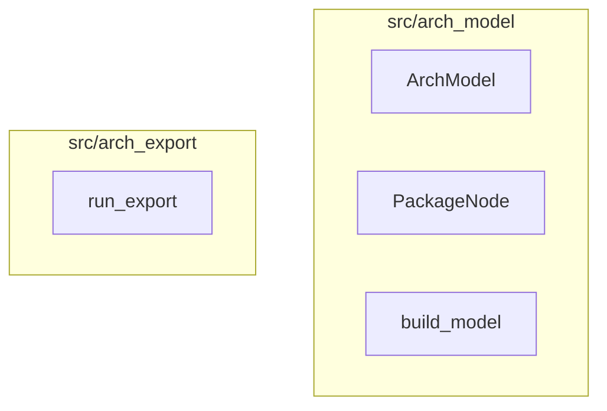

# UX Design: architecture-export

**Date**: 2026-08-23
**Phase**: SDD Phase 3 (design), building on `research/ux.md` and `implementation/plan.md`

This feature has no GUI — every surface is CLI stdout/exit code, MCP JSON request/response,
or LSP protocol payloads consumed by an editor's built-in symbol UI. Each surface below is
condensed to: a representative sample, the interaction flow, and error/edge-case handling,
per the non-interactive format called for by these surface types. Flags, field names, and
message text below are drawn directly from `implementation/plan.md`'s committed stories —
this is not a generic redesign.

---

## Surface 1: `kibitzer architecture export`

CLI verb that writes a pretty-printed `ArchModel` JSON artifact to disk (Epic 2.1).

### Sample

```
$ kibitzer architecture export --path . --out arch.json
wrote arch.json (12 packages, 84 symbols; 6 files skipped as generated)
$ echo $?
0
$ jq '.packages["src/arch_model"].symbols[].name' arch.json
"ArchModel"
"PackageNode"
"build_model"
```

`arch.json` (excerpt):
```json
{
  "repo_root": ".",
  "packages": {
    "src/arch_model": {
      "path": "src/arch_model",
      "files": ["src/arch_model.rs"],
      "symbols": [
        {
          "id": "src/arch_model::ArchModel",
          "name": "ArchModel",
          "kind": "type",
          "file": "src/arch_model.rs",
          "line": 42,
          "exported": true,
          "parent": null
        }
      ]
    }
  },
  "import_edges": [{"from": "src/arch_model", "to": "src/cache", "file": "src/arch_model.rs", "line": 7}],
  "pruning": {"include_private": false, "excluded_dirs": [], "generated_files_skipped": 6, "private_symbols_skipped": 23}
}
```

### Flow

1. Human or CI runs `kibitzer architecture export --path <p> [--out <file>] [--scope <glob>] [--include-private] [--dry-run]`.
2. kibitzer walks in-scope files, builds `ArchModel`, and either writes `--out` (default 0 exit, one-line stdout summary) or, with `--dry-run`, prints the same JSON to stdout and writes nothing.
3. Later, a human or agent re-derives the same artifact any time by re-running the command (or reads it via `jq`/`grep`/version control) — there is no live session state tying export to a later query; each surface (export file, MCP query, LSP) independently rebuilds or reads its own copy of `ArchModel`.

### Errors / edge cases

- **No supported languages under `--path`**: stdout prints exactly `no supported languages found under <path>; nothing to export`, no file is written, exit code `0` (this is a valid outcome, not a failure — matches the `list_checks`/`architecture_assessment` "found nothing" convention).
- **`--scope` glob matches nothing**: stdout prints exactly `no packages matched scope "<glob>" under <path>; nothing to export`, no file is written, exit code `0` — names the scope, not just the path, per Story 2.1.1's dedicated AC for this case.
- **I/O failure writing `--out`** (e.g. unwritable directory): propagated via `anyhow`, nonzero exit, stderr message naming the path — standard kibitzer convention, no new failure mode.
- **File already exists at `--out`**: silently overwritten (no `--force` gate in v1, per research's `cargo metadata`-precedent finding) — the one-line summary on success still fires, so a human re-running the command sees confirmation it happened, not silence.

---

## Surface 2: `kibitzer architecture diagram`

CLI verb producing a text-tree plus an optional Mermaid C4-*like* diagram, never Mermaid-only (Epic 2.2).

### Sample

```
$ kibitzer architecture diagram --path . --level code --scope "src/arch_*"
# Component/Code diagram — inspired by C4, not a standards-conformant C4 Context/Container diagram

src/arch_model
  ArchModel (type)
  PackageNode (type)
  build_model (function)
src/arch_export
  run_export (function)


```

### Flow

1. Human runs `kibitzer architecture diagram --path <p> [--scope <glob>] [--level component|code] [--out <file>]`.
2. kibitzer builds `ArchModel`, renders the text-tree unconditionally, then attempts the Mermaid render; if under the node cap, both sections are emitted (text-tree first, matching `architecture_assessment`'s existing text-then-diagram ordering); output goes to stdout or `--out`.
3. Typical human next step: paste the Mermaid fence into a PR description or open it in a Mermaid-aware viewer; the text-tree above it is what a non-Mermaid reader (or reviewer skimming a PR on a client that doesn't render Mermaid) reads instead.

### Errors / edge cases

- **Over the node cap** (component count at `--level component`, symbol count at `--level code`, capped at `mermaid.rs::MAX_NODES = 150`): Mermaid section is replaced by a note in the same shape as `mermaid.rs`'s existing fallback ("N nodes, over the 150-node diagram cap — pass a narrower `--scope` to render a subgraph instead"); **text-tree section still renders in full** — this is the accessibility-critical behavior (see Acceptance Criteria).
- **No supported languages**: same message/exit-code convention as `export` (`no supported languages found under <path>; nothing to export`) — no partial/empty diagram output.
- **`--help` must self-disclose non-conformance**: `kibitzer architecture diagram --help` output contains the substring "not a standards-conformant C4" (Story 2.2.1's own AC) — this is a UX requirement baked directly into the CLI, not just documentation.
- **The disclaimer also travels with the artifact itself**, not only `--help`: the text-tree's first line is the `# Component/Code diagram — inspired by C4...` comment, and the Mermaid fence's first line is the `%% inspired by C4...` comment (see the Sample above) — so a diagram pasted into a PR/wiki/chat with no CLI context still carries the disclaimer (Story 2.2.1's inline-disclaimer AC, closing pre-mortem Failure Mode #5).

---

## Surface 3: MCP `list_architecture_symbols`

Scoped, paginated JSON query tool — the "Grep, not whole-repo report" mental model (Epic 3.1, Story 3.1.1).

### Sample request/response

Request:
```json
{"path": ".", "package": "src/arch_model", "kind": "function", "level": "code", "limit": 50}
```

Response (the tool's return string, parsed):
```json
{
  "total_matched": 3,
  "returned": 3,
  "next_cursor": null,
  "possibly_pruned": false,
  "symbols": [
    {"package": "src/arch_model", "symbol": {"id": "src/arch_model::build_model", "name": "build_model", "kind": "function", "file": "src/arch_model.rs", "line": 120, "exported": true, "parent": null}}
  ]
}
```

No-match response, truly nothing there (not an error):
```json
{"total_matched": 0, "returned": 0, "next_cursor": null, "possibly_pruned": false, "symbols": []}
```

No-match response where the package's only symbols are unexported and were pruned by the
default `include_private: false` (still not an error — `possibly_pruned` is the signal
that distinguishes this from the truly-empty case above):
```json
{"total_matched": 0, "returned": 0, "next_cursor": null, "possibly_pruned": true, "symbols": []}
```

### Flow

1. Agent calls `list_architecture_symbols` with `path` and any combination of `scope`/`package`/`kind`/`level`/`include_private`/`limit`/`cursor`.
2. `KibitzerServer` resolves `ArchModel` via `ModelCache::get_or_build` (cheap on a repeat call in the same session with unchanged files — no re-parse), applies filters, and returns real JSON (not the flat-string convention the other three MCP tools use — deliberately, per ADR-001).
3. If `total_matched > limit`, agent re-calls with `cursor: next_cursor` to page through — same call shape, no separate "continue" tool.
4. Follow-up: agent typically takes one `symbol.id` from the response and calls `get_architecture_node` (Surface 4) for a focused single-node lookup instead of re-filtering the list.

### Errors / edge cases

- **Zero matches**: `total_matched: 0, symbols: []` — a normal successful response, no MCP error, no exception. Per UX research this must never be silent: the empty array here is self-explanatory *because* `total_matched` and the request's own filters make the "why empty" reason reconstructable by the agent without extra prose — see Acceptance Criteria for why this is judged sufficient vs. `get_architecture_node`'s explicit `not_found` kind (below), where reconstructability doesn't hold.
- **Zero matches that may only be pruned, not absent**: when `total_matched: 0` and the request used the default `include_private: false`, the response's `possibly_pruned` field distinguishes "nothing here" (`false`) from "the requested package/scope has unexported symbols that were filtered out by the default" (`true`) — checked cheaply against the already-computed `ArchModel.pruning.pruned_symbol_ids` field, no second build. An agent seeing `possibly_pruned: true` knows to retry with `include_private: true` before concluding the symbol doesn't exist (closes pre-mortem Failure Mode #2, P2).
- **Malformed request** (e.g. `kind` not one of `type|interface|function|method`): schema validation at the MCP layer rejects before reaching the handler — standard `rmcp`/schemars behavior, no custom handling needed, but the field's doc comment must enumerate the valid values so an agent doesn't have to guess (per UX research's "every field states its own contract" finding).
- **Model not yet built (cold cache, large repo)**: the call blocks until `build_model` completes (no async/progress protocol in MCP tool calls) — this is a known, accepted latency characteristic, not an error state; there is no partial-result option for MCP tool calls the way LSP has `Ok(None)`.

---

## Surface 4: MCP `get_architecture_node`

Single-node exact-reference lookup — the natural second call after Surface 3 (Epic 3.1, Story 3.1.2).

### Sample request/response

Request: `{"path": ".", "node": "src/arch_model::build_model"}`

Response:
```json
{"kind": "symbol", "body": {"id": "src/arch_model::build_model", "name": "build_model", "kind": "function", "file": "src/arch_model.rs", "line": 120, "exported": true, "parent": null}}
```

Package-form request: `{"path": ".", "node": "src/arch_model"}` →
```json
{"kind": "package", "body": {"path": "src/arch_model", "files": ["src/arch_model.rs"], "symbols": [/* ... */]}}
```

Not-found request, truly nothing there: `{"path": ".", "node": "does/not/exist"}` →
```json
{"kind": "not_found", "node": "does/not/exist", "exists_but_pruned": false}
```

Not-found request where the node exists only as an unexported symbol pruned by the default
`include_private: false`: `{"path": ".", "node": "src/arch_model::doHelper"}` →
```json
{"kind": "not_found", "node": "src/arch_model::doHelper", "exists_but_pruned": true, "hint": "retry with include_private: true"}
```

### Flow

1. Agent already has a `node` reference (a package path or a `symbol.id`) — typically from a prior `list_architecture_symbols` call, an import edge, or a diagnostic message.
2. Single call, single response; `kind` tags which of the three shapes (`package`/`symbol`/`not_found`) the body is, so the agent can dispatch without probing.
3. No pagination needed — one node's own children are the entire response by construction.

### Errors / edge cases

- **No match**: explicit `{"kind": "not_found", "node": "<query>", "exists_but_pruned": bool}` — still a normal (non-error) MCP response, but *unlike* Surface 3's bare empty array, this one names the queried value back so an agent that fired off several lookups in parallel/sequence can tell which one failed without correlating by request order.
- **Exists, but pruned**: when the queried `node` doesn't resolve to a package or an already-pruned symbol id, but does match an id in `ArchModel.pruning.pruned_symbol_ids` (i.e. it's an unexported symbol excluded by the default `include_private: false`), the response is `{"kind": "not_found", "node": "<query>", "exists_but_pruned": true, "hint": "retry with include_private: true"}` instead of the plain not-found shape — a single cheap scan against the already-computed pruning field, no second build (closes pre-mortem Failure Mode #2, P2). This is the concrete case that motivated splitting Surface 3's bare `[]` (reconstructable from the request's own filters) from Surface 4's explicit `not_found` kind: a single exact-reference miss has no other filters an agent could use to reconstruct "was this pruned or absent," so the tool states it directly.
- **Ambiguous resolution order**: `node` is tried as a package key first, then a symbol id — a pathological repo where a package path string collides with a symbol id string would resolve to the package (documented order, not a design gap the plan leaves open, but worth the tool description stating "package path checked first" explicitly since it's not otherwise guessable).

---

## Surface 5: LSP `textDocument/documentSymbol` and `workspace/symbol`

Editor-native surface (e.g. VS Code's "Outline" view and Ctrl+T/Cmd+T "Go to Symbol in Workspace") — the only surface here consumed through a GUI, but one kibitzer doesn't render itself (Epics 4.1–4.3).

### Sample (as JSON-RPC, what a human sees rendered by the editor)

`textDocument/documentSymbol` response for a Go file with `type Reader interface { Read() }`:
```json
[{"name": "Reader", "kind": 11, "range": {...}, "children": [{"name": "Read", "kind": 6, "range": {...}}]}]
```
→ renders in VS Code's Outline panel as a collapsible `Reader` (interface icon) containing `Read` (method icon).

`workspace/symbol` response for query `"Re"` (Cmd+T, typed "Re"), index already `Ready`:
```json
[{"name": "Reader", "kind": 11, "location": {"uri": "file:///.../reader.go", "range": {...}}}]
```
→ renders in VS Code's quick-open list as a jump target.

`workspace/symbol` response for *any* query while the background index is still building (`index_state == Building`):
```json
[{"name": "⏳ kibitzer: still indexing this workspace — try again shortly", "kind": 1, "location": {"uri": "file:///<workspace-root>", "range": {...}}}]
```
→ renders as a single, self-explanatory entry in the quick-open list — never an empty list, never a hang.

### Flow

*(Revised 2026-08-24 — this surface's design changed during Phase 3 review: the original plan had `workspace/symbol` build the whole-repo model synchronously inline on the request that happened to be first in a session, which review correctly rejected as a request handler that could block/time out an editor client. The committed design (Story 4.3.0/4.3.1) is a background index instead — described below.)*

1. **Document symbols**: editor sends `textDocument/documentSymbol` on file open/focus (client-driven, no user action needed) → kibitzer re-reads that one file from disk (disk-snapshot model, matching existing diagnostics), extracts symbols directly (no whole-repo `build_model`), returns a nested tree **including private symbols** (file-scoped view has no noise problem to prune for) → editor renders its Outline UI. This path is unaffected by the background index below — it never needs the whole-repo model.
2. **Background indexing starts automatically, not on first request.** As soon as the LSP session initializes (`initialized()`), kibitzer spawns the whole-repo `build_model` in the background (`tokio::task::spawn_blocking`) and tracks progress via `index_state: Building → Ready(model) | Failed(_)`. No request ever triggers this build itself — the request path only *reads* whatever `index_state` currently holds.
3. **Workspace symbols, index not ready yet**: user opens "Go to Symbol in Workspace" and types a query before the background build finishes → `workspace/symbol` returns immediately (never blocks) with the single synthetic "still indexing" entry shown in the sample above, ignoring the typed query → editor shows that one self-explanatory result instead of hanging or showing an empty list.
4. **Workspace symbols, index ready**: same picker, same query, once `index_state == Ready(model)` → kibitzer substring-filters the query against the model's **pruned** (exported-only by default) symbol names → editor renders the match list. This is fast (in-memory), never re-triggers a build.
5. `did_save` on any in-scope file: if the index is `Ready`, kibitzer spawns a fresh background rebuild (never inline, never blocking the save or the next request) tagged with a monotonic generation counter, so an out-of-order-completing older rebuild can't clobber a newer one's result; if the index is still `Building` from startup, `did_save` is a no-op (the in-flight initial build already reads current on-disk content once it gets there).

### Errors / edge cases

- **File with no `Language` mapping** (e.g. a `.md` file opened with kibitzer active): `document_symbol` returns `Ok(None)` — editor shows an empty Outline, no error toast, no panic.
- **No `.claude/inspect.json` found for the workspace, or the initial build otherwise fails**: `index_state` becomes `Failed(_)`; `workspace/symbol` returns `Ok(None)` — editor's symbol picker shows "no results," not an error toast, matching Surface 3/4's "empty is normal" convention translated into LSP's idiom.
- **Large repo, cold start**: the background index build still takes real wall-clock time (same cost as a CLI `export`), but it never blocks a request — a `workspace/symbol` search during that window gets the "still indexing" entry (see Flow step 3), not a slow/hung response. `docs/lsp.md` (Task 4.3.1d) documents this explicitly, including that `document_symbol` and `workspace/symbol` apply different pruning defaults (private-inclusive vs. exported-only) and that `workspace/symbol` has no way to signal "exists but pruned" the way the MCP tools do (a genuine LSP-protocol-shape limitation at this repo's pinned `lsp-types`/`tower-lsp` versions, not an oversight) — use `list_architecture_symbols`/`--include-private` for a definitive check.
- **Rapid-fire saves** (format-on-save plus a manual save, common during active editing): each `did_save` while `Ready` spawns a new rebuild; the generation-gated swap (Flow step 5) guarantees the index only ever reflects the most-recently-*started* rebuild's result, never an older one completing late and overwriting a newer one.
- **Editor closes/reopens (new LSP session)**: the index is process-lifetime only (ADR-002, no persistence) — every fresh `kibitzer lsp` process rebuilds from scratch at startup; this is consistent with kibitzer's existing no-persistent-daemon-integration choice for this feature and isn't a regression from any existing behavior.

---

## UX Acceptance Criteria

Testable, cross-surface. Each ties to a specific plan story or research finding where one exists.

1. **No dead ends on "not found."** Every not-found/empty state names what was searched and, where the tool has a next step to suggest, states it: `get_architecture_node`'s `not_found` response echoes back the query `node` value (Story 3.1.2); `export`'s "nothing to export" message names the path (Story 2.1.1); `mermaid`-style cap fallback names the exact flag (`--scope`) to narrow with (Story 2.2.1). None of these leave the caller to guess why a response was empty.
2. **Empty is not silent, but empty is also not an error.** `list_architecture_symbols` with zero matches returns `total_matched: 0, symbols: []` — a normal 200-equivalent response with the count field making the "zero" explicit, not a bare `[]` an agent could mistake for a truncated/broken response, and never an MCP error/exception (Story 3.1.1's Grep-parity AC).
3. **`kibitzer architecture export` with no arguments is fast enough to not break flow.** kibitzer's own repo is Rust — not among this feature's in-scope languages — so it isn't the benchmark; export against a realistic mid-size multi-language fixture (Go/TS/Tsx/JS) should complete and print its summary line in well under the time a developer would notice as "the tool hung" — target **under 5 seconds**, provisional pending `plan.md`'s Task 1.3.1f benchmark (see `implementation/plan.md`'s "Performance Target" section). This is a target for Phase 6 verification to measure against, not a number pulled from a benchmark run yet.
4. **Diagrams never lock a reader out of the underlying information.** `kibitzer architecture diagram` always emits the text-tree section, regardless of node-cap fallback state — a screen-reader user, a PR-review client that doesn't render Mermaid, or a plain-text log consumer gets the full structural answer either way (Story 2.2.1's node-cap AC + UX research's `MAX_NODES` accessibility finding). This is the closest analog to a screen-reader/no-visual-channel accessibility guarantee this feature has, and it is testable: `diagram` output must contain a per-symbol/per-package text line for every node that exists in the filtered model, independent of whether the Mermaid fence is present or replaced by the cap note.
5. **No command overclaims standards conformance.** `kibitzer architecture diagram --help` contains the literal substring "not a standards-conformant C4" (Story 2.2.1) — a testable string-contains assertion, not just a documentation aspiration.
6. **Naming stays inside the established MCP family.** `list_architecture_symbols`/`get_architecture_node` use `path` (not `repo_path`/`root`/`target`) for the repo-root parameter, matching every existing tool (`ListChecksRequest`, `ArchitectureAssessmentRequest`) — a new agent session that has already learned `architecture_assessment`'s schema does not have to relearn a synonym for the same concept (research/ux.md's guessability finding, enforced in Story 3.1.1/3.1.2's request structs).
7. **`get_info()` disambiguates the query tools from the whole-repo tool.** Calling `get_info()` returns `instructions` containing both new tool names and the substring `"JSON"`, so an agent choosing between `architecture_assessment` and `list_architecture_symbols`/`get_architecture_node` has session-level guidance rather than having to infer the right tool from naming alone (Story 3.1.3).
8. **Every optional field states its default inline.** Every new MCP request struct field (`ListArchitectureSymbolsRequest`, `GetArchitectureNodeRequest`) carries a `///` doc comment stating its default and, where relevant, its fallback behavior — matching `ArchitectureAssessmentRequest.scope`/`include_diagram`'s existing precedent, so an agent never has to omit-and-guess (research/ux.md finding, Story 3.1.1 AC).
9. **Pagination is resumable without state loss.** A `list_architecture_symbols` caller that pages through `next_cursor` values receives the full match set exactly once, in stable order (`BTreeMap`-backed model, no reordering between calls within one cache lifetime) — verified by Story 3.1.1's 5-symbol/`limit: 2` paging AC.
10. **A GUI symbol picker never hangs and never shows a bare error for an unindexable state.** `workspace/symbol` never blocks on a build — while the background index is still `Building`, it immediately returns the single synthetic "still indexing" entry (Flow step 3 above) rather than leaving the picker waiting; once `Failed(_)` or on an unsupported file type, `workspace/symbol`/`document_symbol` return `Ok(None)` (empty picker results), never a protocol-level error — an editor user always sees a self-explanatory state, never a hang or an error toast that reads as a kibitzer bug (Stories 4.2.1, 4.3.0, 4.3.1).
11. **Cold-start latency and pruning-signal limitations are disclosed, not hidden.** The background index still takes real wall-clock time to build on a large repo (though it never blocks a request — see criterion 10), and `workspace/symbol` has no way to distinguish "truly absent" from "exists but pruned" the way the MCP tools' `possibly_pruned`/`exists_but_pruned` fields do. Both are documented at the point a user would hit them — `docs/lsp.md` (Task 4.3.1d), cross-linked from `README.md`'s `kibitzer lsp` entry — not left implicit in the plan only, so a slow initial index or an unexpectedly-empty search reads as a known, explained tradeoff, not a mystery.
12. **Exit codes carry no false signal.** `kibitzer architecture export`'s exit code is `0` on any successful write regardless of how small/empty the resulting model is — a CI pipeline scripting on exit code never mistakes "small repo" or "nothing new to report" for a failure (Story 2.1.1 AC, research/ux.md's exit-code finding).

---

## Previously flagged UX gap — closed

Story 2.1.1's AC originally covered only the *no-supported-languages* empty case for
`export`, not the *narrower* case of a `--scope` glob that matches zero packages in an
otherwise non-empty repo (e.g. `--scope "nonexistent/**"`). This is now closed: `plan.md`'s
Story 2.1.1 has an explicit AC for the scoped-zero-match case (`no packages matched scope
"<glob>" under <path>; nothing to export`, no file written, exit 0 — reusing the same
"explicit message, exit 0" shape as the zero-languages case), added in the P1 repair pass
that followed this feature's Phase 4 review. See Surface 1's Errors/edge-cases section
above, which already reflects this.
