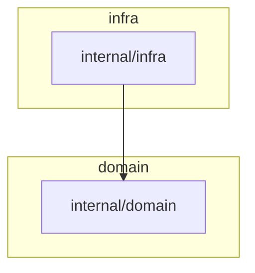

# UX Design: Architecture Linting

Phase 3 design artifact, turning `research/ux.md`'s recommendations into a concrete
spec matched against `implementation/plan.md`'s actual acceptance criteria. Surface:
config files + CLI/MCP-tool-output. No GUI, no WCAG/ARIA/keyboard-nav applicability —
every surface below is non-interactive (a file the user edits, or text kibitzer
prints), so each gets one representative sample + acceptance criteria rather than a
wireframe or interaction-flow diagram.

**Sources**: `research/ux.md` (prior research), `implementation/plan.md` (Domain
Glossary; Phase 0 Stories 0.1.1–0.1.3; Phase 1 Stories 1.1.1–1.2.2; Phase 6; Phase 7),
`src/config.rs:155–194`, `src/mcp.rs:60–270` (read directly to verify severity/output
wiring).

---

## Surfaces

### (a) `.claude/inspect.json` config authoring

Declares `components` / `dependency_rules` / `content_rules` / `naming_rules`.

```jsonc
{
  "architecture": {
    "components": [
      { "name": "handlers", "paths": ["cmd/**", "internal/handlers/**"] },
      { "name": "domain",   "paths": ["internal/domain/**"] },
      { "name": "infra",    "paths": ["internal/infra/**"] }
    ],
    "dependency_rules": [
      { "component": "domain", "may_depend_on": [] },
      { "component": "infra",  "may_depend_on": ["domain"], "deny_depend_on": ["handlers"] }
    ],
    "content_rules": [
      { "component": "domain", "allowed_kinds": ["struct"] }
    ],
    "naming_rules": [
      { "component": "infra", "kind": "struct", "pattern": ".*Repository$|.*Client$" }
    ]
  }
}
```

**Flow**: user hand-edits `.claude/inspect.json` (no scaffolding/generator exists in
this plan — confirmed by `research/ux.md`'s JTBD §4: "none of the three tools
researched has an 'infer starter config' mode," and nothing in `plan.md` adds one).
On the next `kibitzer run`/hook invocation, `find_config` parses and validates the
block; a bad reference fails fast (see surface (d)); a valid config runs silently
until a check fires.

**Acceptance criteria**:
- `layers: [...]` continues to parse with `components`/`dependency_rules`/
  `content_rules`/`naming_rules` defaulting to empty `Vec`s — no existing config
  breaks (Story 0.1.1, `#[serde(default)]` on all four fields).
- `dependency_rules` is keyed by the *source* component (`component` field) with
  explicit `may_depend_on` (allow) and `deny_depend_on` (deny) lists; an
  unconfigured-but-declared component defaults to **deny** (may depend on itself
  only), and deny wins when a name appears in both lists (Pattern Decisions table;
  Story 1.1.1's 2nd/3rd acceptance criteria).
- Declaring the same name in both `layers` and `components` is a hard load-time
  error naming the collision (Story 0.1.2, 5th criterion).
- **Gap vs. `research/ux.md`**: the research's illustrative schema (§1) used
  camelCase field names lifted from `go-arch-lint` (`mayDependOn`, `mayNotDependOn`)
  under a top-level `deps:`/`rules:` block. The plan's actual schema
  (`DependencyRule.may_depend_on` / `.deny_depend_on`, flat under
  `dependency_rules`) uses kibitzer's own snake_case convention and renames
  "may not" to "deny" — a deliberate, reasonable divergence (consistent with
  `architecture_checker`/other existing fields being snake_case), but an author
  porting a mental model directly from the research doc's mockup or from a
  `go-arch-lint.yml` file will type the wrong field names on the first pass. Not a
  blocker, but the eventual `docs/` page for this feature should show the real
  field names, not the research doc's sketch.

### (b) CLI output — `kibitzer check architecture <name> <dir>`

```
$ kibitzer check architecture component-deps testdata/dogfood-architecture
domain/domain.go:5: [component-deps] domain (dogfood.example/app/domain) imports infra (dogfood.example/app/infra) — 'domain' may depend on: domain
$ echo $?
1
```

Unknown-checker case:

```
$ kibitzer check architecture does-not-exist .
no architecture checker named 'does-not-exist' registered
$ echo $?
1
```

**Flow**: user (or agent) runs the subcommand directly against a directory to verify
one rule fires, without a full batch run or MCP round-trip — this closes the gap
`run_architecture_check`'s own `cmd_str` already implied existed (plan.md's
Unresolved Question #1). Output is one `{file}:{line}: {message}` line per finding,
no `[level]` wrapper (this path bypasses `Check.severity` entirely — it's a direct
checker invocation, not a config-driven run).

**Acceptance criteria**:
- A real violation prints a line containing the file path and the `[component-deps]`
  bracket tag, and the process exits non-zero (Story 1.2.2, 1st criterion).
- An unknown checker name prints to stderr and exits non-zero (Story 1.2.2, 2nd
  criterion).
- **Gap vs. established kibitzer tone**: the task brief for this design explicitly
  asks whether error paths match kibitzer's existing "`unknown checker 'x'` — run
  `kibitzer check list`" tone. Verified against real source
  (`src/config.rs:166–176`): the sibling error for a bad *per-file* `checker` name
  already says `"...references unknown checker 'x' — run \`kibitzer check list\`
  for available checkers"`. The **existing** (pre-this-feature) sibling error for a
  bad `architecture_checker` name (`src/config.rs:177–184`) has **no** next-action
  clause at all — just `"...references unknown architecture checker 'x'"`. Story
  1.2.1 only rewires this branch to a dual-registry lookup (Task 1.2.1d); it does
  not add a next-action suffix. Story 1.2.2's new CLI error
  (`"no architecture checker named 'x' registered"`) repeats the same omission
  verbatim. **This is a real, pre-existing gap that this feature inherits and
  extends to a second call site rather than closing** — there is also no
  `kibitzer check architecture list` (or equivalent) for a next-action clause to
  point *to*, so closing this gap requires either adding such a listing subcommand
  or pointing at `kibitzer check list` if that command already enumerates
  architecture/declaration checkers (unconfirmed in the plan). Flagged for
  implementation to resolve, not silently carried forward.

### (c) `architecture_assessment` MCP tool output

```
architecture assessment: 12 finding(s) across 84 file(s)
  import-cycle: 1, layering: 3, coupling: 2, component-deps: 1, content: 4, naming: 2
[blocking] [layering] internal/infra/db.go:22: layering violation: ...
[advisory] [component-deps] component 'domain' (glob '**/domain') matched 0 nodes in the import graph — rules referencing it will never fire
[advisory] [content] internal/domain/http.go:14: 'httpClient' (function) is not allowed in component 'domain' — allowed kinds: struct
[advisory] [naming] infra/infra.go:4: struct 'OrderStore' in component 'infra' does not match required pattern '.*Repository$|.*Client$'

## Recommendations
- component-deps: either relocate the offending code into a component already allowed to hold that dependency, or add it to the target component's may_depend_on list if the dependency is actually intended.
- layering: move the offending import behind an interface owned by the higher layer, or relocate the responsibility that requires it into a layer that's already allowed to depend downward.

## Dependency graph

```

**Flow**: agent or user calls the `architecture_assessment` MCP tool; kibitzer builds
the import graph (and, once Phase 2 lands, the declaration graph), runs every
configured `architecture_checker`/`declaration_checker`, and returns one flat,
grep-able text block — count line, per-category breakdown, findings, canned
recommendations, Mermaid diagram grouped into per-component `subgraph` blocks.

**Acceptance criteria**:
- Every finding line carries a mandatory `[category]` bracket prefix, and by end of
  Phase 6 all six categories (`import-cycle`, `layering`, `coupling`,
  `component-deps`, `content`, `naming`) are prefixed uniformly — `import-cycle` and
  `layering` are the two that need retrofitting (`coupling`/the three new checkers
  already emit theirs from Phases 1–3); `grep '\[naming\]'` (or any category) works
  only once Phase 6 ships, not incrementally as each phase lands (Story 6.1.1).
- A per-category count breakdown line appears immediately under the aggregate count,
  parsed from the same bracket prefixes (Story 6.1.2). **Minor plan-internal gap**:
  the story's own illustrative example and its category-breakdown helper's declared
  parse order both name six categories in prose (`import-cycle, layering, coupling,
  component-deps, content, naming`), but the concrete Given/When/Then only exercises
  five (`component-deps` absent from the example run). Not a design defect, but the
  eventual test coverage should include a `component-deps` finding in the breakdown
  fixture, not just the five inherited from before this feature.
- `content-rules`/`naming-rules` findings reuse `ArchFinding` unmodified — a
  location-pinned message (`{file}:{line}: ...`) when a real declaration site exists
  (always true for `naming`; true for `content` in v1 since content rules are
  per-declaration, not component-wide) — no new finding shape introduced (Stories
  2.2.1, 3.1.1).
- The Mermaid diagram groups nodes into `subgraph {component}` blocks by resolved
  component; nodes matching no component render outside any subgraph exactly as
  today (Story 6.2.2).
- **Gap — severity conflation on zero-match advisories (see below, this is the
  headline finding of this design pass)**.

### (d) Config validation errors

Two distinct mechanisms, matching `research/ux.md`'s a/b/c split — **but the plan
only correctly implements the b) half of that split; the a)/c) half is compromised
by an implementation detail not caught in research**. Verified against
`src/mcp.rs:176–183` and `src/config.rs:155–194` directly (not inferred).

**b) Load-time hard error — undefined component reference (typo)**:

```
.claude/inspect.json: architecture rule references undefined component 'hanlders' — declared components are: handlers (did you mean 'handlers'?)
```

- Fires from `validate()` at config-load time, before any check runs — so both
  `kibitzer run` and the `PostToolUse` hook path fail fast (Story 0.1.3).
- Covers `DependencyRule.component`, names inside `may_depend_on`/`deny_depend_on`,
  and `ContentRule.component`/`NamingRule.component` (Task 0.1.3b).
- Levenshtein distance ≤2 against declared names produces a `(did you mean 'x'?)`
  suffix; the clause is omitted (not printed as `(did you mean 'None'?)` or similar)
  when no name is within distance 2 (Task 0.1.3a/b, `unknown_component_error_omits_suggestion_when_no_close_match`).
  **Verified this matches the exact criterion this design pass was asked to
  check** — the plan really does implement "names the exact bad value and suggests
  the closest declared name within edit-distance 2."
- An invalid naming-rule regex is also a load-time error (`"invalid naming rule
  pattern"`, Story 3.1.1's 4th criterion) — same fail-fast tier as (b), correctly
  distinct from the advisory tier below.

**a/c) Advisory — zero-match component glob / zero-match naming pattern**:

```
[advisory] [component-deps] component 'domain' (glob '**/domain') matched 0 nodes in the import graph — rules referencing it will never fire
[advisory] [naming] naming rule for component 'handlers' kind 'interface' matched 0 declarations — pattern '.*Handler$' will never fire
```

- Format matches `research/ux.md`'s stated *intent* (advisory, one line, not a hard
  error, emitted from inside the assessment output the user already reads) but
  **not its literal proposed message shape** — the research mocked up a distinct
  `[advisory] architecture config: component '...' ...` pseudo-category, separate
  from any real checker's category tag. The plan instead folds the advisory into
  the *same* checker's own findings (`[component-deps]` for the zero-match-component
  case, `[naming]` for the zero-match-pattern case) rather than a dedicated
  "architecture config" tag. This is a smaller gap than the severity one below, but
  it does mean a zero-match-component advisory only appears in output when
  `component-deps` is a configured `Check` — see next bullet.

**Verified, headline gap — zero-match findings can render as `[blocking]`,
contradicting the required a/c "advisory, never masquerading as blocking" split**:

`src/mcp.rs:176–183` shows `level` is derived once per `Check`, from
`result.severity` (i.e. `Check.severity` as configured in `.claude/inspect.json`),
and applied uniformly to *every* line in that check's `result.output` — including
the zero-match advisory lines Stories 1.1.3/3.1.2 add. `ArchFinding` (per the Domain
Glossary) has no per-finding severity field of its own, and nothing in Phase 0–6
adds one (`Pattern Decisions` table explicitly defers "per-rule severity" for a
different reason — real-violation severity, not this). **Concretely**: if a user
configures `component-deps` as `"severity": "blocking"` (the natural choice for a
real architecture violation they want to fail CI), the zero-match-component-glob
advisory for that same checker is *also* emitted as `[blocking]` and fails the run
— even though `research/ux.md` explicitly designed this case to never be a hard
failure, precisely because a fresh project or a narrowed `--scope` invocation makes
"zero matches" legitimate on a first run. This directly violates the UX acceptance
criterion this design pass was asked to verify ("no advisory finding masquerades as
a blocking error"). **This is a real gap for implementation to close** — options
include giving `ArchFinding` an optional severity override that a zero-match
advisory sets unconditionally to `Advisory` regardless of the Check's configured
severity, or splitting zero-match findings into a separate always-advisory output
channel. Neither is in the current plan; Phase 0–6 as written ships this bug.

**Second verified gap — zero-match-component advisory is checker-scoped, not
config-scoped**: Story 1.1.3 implements the zero-match-component-glob check inside
`ComponentDependencyChecker::check()` specifically (Task 1.1.3a: "for each component
in `config.effective_components()` ... push the advisory finding" — this code path
only runs when `component-deps` executes). A project that declares `components` and
uses only `content-rules`/`naming-rules` (no `component-deps` check registered)
never sees the "component X matched 0 files" advisory at all, even though a typo'd
glob is exactly as dead for content/naming rules as for dependency rules.
`research/ux.md`'s design intent was a component-level sanity check independent of
which rule categories consume the component; the plan implements it as one
checker's side effect.

**Acceptance criteria for surface (d)**:
- Undefined-component-reference errors fail at config-load time with the exact bad
  value and a same-or-closer-than-2 Levenshtein suggestion — **met** (Story 0.1.3,
  verified above).
- Zero-match conditions never fail a run and never inherit a stricter severity than
  `Advisory` — **not met as currently planned**; see the headline gap above.
- Every load-time error names the next action (fix the typo, or in the CLI
  subcommand and pre-existing `architecture_checker` cases, discover the valid
  name) — **partially met**: the (b) typo error is exemplary (names the bad value,
  lists valid names, suggests a fix). The unrelated pre-existing
  "unknown architecture checker" error and the new CLI subcommand's unknown-checker
  error both lack a next-action clause; see surface (b) above.

---

## UX Acceptance Criteria (consolidated, testable)

1. Every existing `layers`-only config parses unchanged and produces byte-identical
   `LayeringChecker` findings after this feature ships (Story 1.1.2's golden tests).
2. A config-load error for an undefined component reference (in `dependency_rules`,
   `content_rules`, or `naming_rules`) names the exact bad value and suggests the
   closest declared name within edit-distance 2, omitting the suggestion clause
   when none is close enough — **met**, verified against Task 0.1.3a/b.
3. Every finding line is grep-able by category via a mandatory `[category]` bracket
   prefix, uniform across all six categories — **met only after Phase 6 ships**
   (Story 6.1.1 retrofits `import-cycle`/`layering`; the other four already have it
   from Phases 1–3).
4. A per-category count breakdown line appears under the aggregate finding count in
   `architecture_assessment` output — **met** (Story 6.1.2), with the minor
   incompleteness noted above (illustrative example/fixture omits `component-deps`).
5. No advisory finding masquerades as a blocking error, and no blocking error is
   silently downgraded to an advisory — **not met**: zero-match advisories
   (Stories 1.1.3, 3.1.2) inherit the configuring `Check`'s severity verbatim
   (`src/mcp.rs:176–183`), so a `component-deps`/`naming-rules` check configured as
   `blocking` turns its own zero-match advisories into build-breaking errors. Flag
   for implementation; not silently papered over.
6. A component's zero-match-glob advisory fires regardless of which rule category
   (`dependency_rules`/`content_rules`/`naming_rules`) references it — **not met**:
   currently scoped to `ComponentDependencyChecker` only.
7. Deny-by-default and deny-wins-over-allow are the documented, tested precedence
   rules for `dependency_rules` — **met** (Story 1.1.1, Pattern Decisions table).
8. The `kibitzer check architecture <name> <dir>` CLI verb prints one
   `{file}:{line}: {message}` line per finding and exits non-zero on any finding,
   with a distinct, non-zero-exit message for an unknown checker name — **met**,
   but that unknown-checker message has no next-action clause (see surface (b)),
   matching a pre-existing gap in the sibling `architecture_checker` config error
   rather than closing it.
9. Content/naming findings reuse `ArchFinding`'s existing `Option<PathBuf>`/
   `Option<usize>` fields — no new finding shape, no redesign of the flat
   grep-able output philosophy — **met** (Stories 2.2.1, 3.1.1, and requirements.md's
   explicit "without a redesign of that surface" scope constraint).
10. The Mermaid diagram groups nodes by resolved component into `subgraph` blocks,
    with unmatched nodes rendering exactly as before — **met** (Story 6.2.2).

---

## Summary of gaps between `research/ux.md` and `implementation/plan.md`

| # | Gap | Severity | Where |
|---|---|---|---|
| 1 | Zero-match advisory findings inherit the configuring Check's severity — can render `[blocking]` | **High** — violates the explicit a/c design requirement and this task's own acceptance criterion | Stories 1.1.3, 3.1.2; `src/mcp.rs:176–183` |
| 2 | Zero-match-component-glob advisory only fires via `ComponentDependencyChecker`, not for content/naming-only configs | Medium | Story 1.1.3 (Task 1.1.3a) |
| 3 | "Unknown architecture checker" / new CLI unknown-checker errors lack a next-action clause, unlike the sibling per-file-checker error | Medium — pre-existing gap, extended not closed | `src/config.rs:177–184` (pre-existing); Story 1.2.2's new CLI error |
| 4 | Advisory message shape uses the firing checker's own category tag (`[component-deps]`, `[naming]`) rather than research's proposed dedicated "architecture config" pseudo-category | Low | Stories 1.1.3, 3.1.2 vs. `research/ux.md` §2 |
| 5 | Config schema field names/casing (`may_depend_on`/`deny_depend_on`, snake_case) diverge from research's illustrative `mayDependOn`/`mayNotDependOn` (camelCase) mockup | Low — deliberate, consistent with kibitzer's own conventions, just worth documenting accurately | Story 0.1.1 vs. `research/ux.md` §1 |
| 6 | Category-breakdown story's example/fixture doesn't exercise all six declared categories | Low | Story 6.1.2 |
